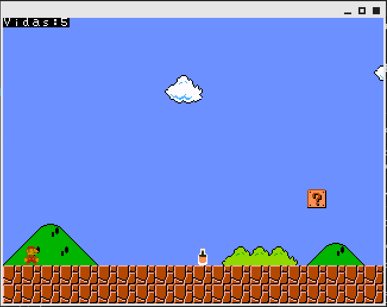
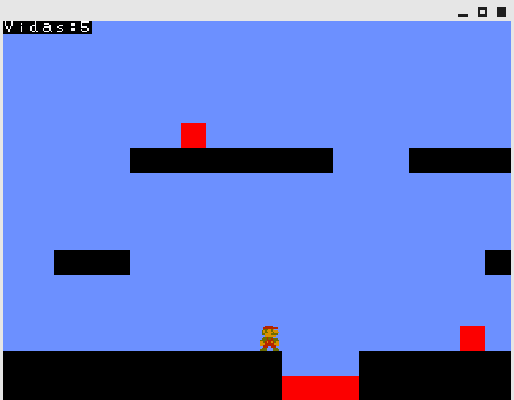

## Super Mario Bros

<h2> Sobre o jogo </h2>

Neste projeto, foi criada uma versão mais simples do Super Mario Bros.

Nele, há um contexto da Universidade de Brasília, onde o grande "inimigo" do jogo são os Sucos do RU. Ao tomar um suco, o jogador perde uma vida e reinicia a fase. Ao perder cinco vidas, o jogador perde o jogo.

<h2> Como utilizar </h2>

Basta executar o FPGRARS com o arquivo main.s:

- No Linux, utilize o comando "./FPGRARS/fpgrars-x86_64-unknown-linux-gnu--unb main.s".

- No Windows, basta arrastar o arquivo main.s para o fpgrars do Windows.

<h2> Como jogar </h2>

| Tecla | Função                       |
|:-----:|------------------------------|
|   W   | Pulo                         |
|   A   | Esquerda                     |
|   D   | Direita                      |
|   M   | Mutar/Desmutar a música      |

<h2> Especificações Técnicas </h2>

As duas grandes mecânicas implementadas neste jogo foram a colisão com algum objeto e a movimentação do background.

### Colisão

Para resolver a colisão, o jogo mantém em memória uma cópia do mapa original como "hitbox", onde cada cor de bloco tem um objetivo:
- A cor azul mostra por onde o personagem pode se mover;
- A cor preta representa um objeto sólido onde o personagem pode pisar;
- A cor vermelha simboliza algum tipo de inimigo, um objeto que gera dano ao tocar no personagem.

Outro problema encontrado foi gerar este mapa de "hitbox". Para isso, foi desenvolvido um script em Python capaz de receber o mapa original e gerar o hitbox. O script também recebe certas "tiles" para encontrar pelo mapa e, em seguida, trocar por alguma cor específica.

Um vídeo demonstrando o hitbox gerado pode ser encontrado [aqui](https://www.youtube.com/watch?v=oYTF9Nh0eNA).

Obs.: No momento da gravação do vídeo acima, ainda não haviam sido implementadas as mecânicas de colisão e gravidade.

### Background móvel

O problema do background é que existe um mapa maior do que a tela que o usuário está visualizando. Então, no jogo, criamos um ponteiro que representa o "offset" de colunas à esquerda em relação à imagem que o usuário está vendo e o mapa original. Assim, na hora de desenhar a tile do mapa, bastava ver o (x, y) pela visão do usuário e somar este offset na coluna.

Sabendo disso, bastava realmente mover o background. A lógica utilizada foi a de que quando o personagem se move no centro da tela E não está no final do mapa, então o background deve se mover. Para movê-lo, toda a tela é movida um bloco para a esquerda e a última coluna é desenhada do mapa em memória.

Demonstração da lógica de mover todo o mapa para a esquerda [aqui](https://www.youtube.com/watch?v=IoglPbp1Rqo).

Movimentação completa do background [aqui](https://www.youtube.com/watch?v=kefFifiG4AA).

<h2> Observações </h2>

- Por algum motivo do compilador, a música não funciona no ambiente Linux.
